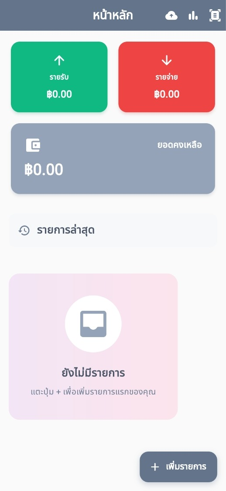
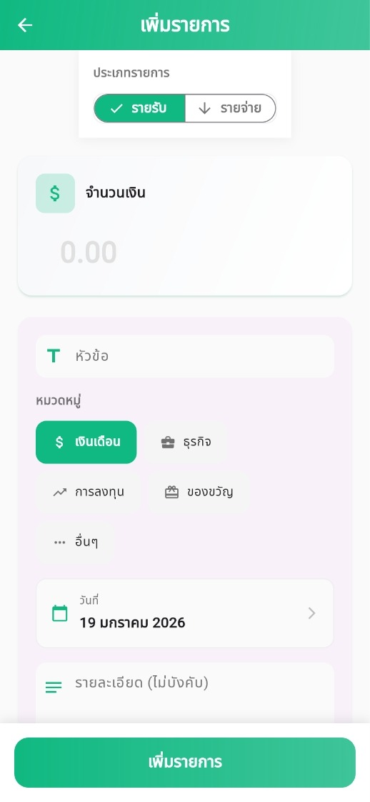

# Keb Tang (เก็บตังค์) 💰

Keb Tang (เก็บตังค์) คือแอปพลิเคชันจัดการการเงินส่วนบุคคลที่พัฒนาด้วย Flutter ช่วยให้คุณจดบันทึกรายรับรายจ่าย สแกนบิลใบเสร็จด้วยระบบ OCR และวิเคราะห์พฤติกรรมการใช้จ่ายของคุณผ่านกราฟและแผนภูมิที่เข้าใจง่าย แอปพลิเคชันถูกออกแบบมาให้มีหน้าตาที่สวยงาม ใช้งานง่าย และรองรับทั้งภาษาไทยเต็มรูปแบบ

## ✨ ฟีเจอร์หลัก (Features)

-   **📊 แดชบอร์ดและสถิติ**: ดูภาพรวมสุขภาพทางการเงินของคุณได้ทันที พร้อมรายการประจำวันและกราฟสรุป (Pie Charts, Bar Charts) ที่สวยงามด้วย `fl_chart`
-   **💸 บันทึกรายรับ-รายจ่าย**: เพิ่มรายการใช้จ่ายและรายรับได้อย่างรวดเร็ว พร้อมหมวดหมู่ที่ปรับแต่งได้
-   **🧾 สแกนบิลอัจฉริยะ**: ไม่ต้องพิมพ์เอง! ใช้กล้องสแกนใบเสร็จได้เลย แอปใช้ **Google ML Kit** เพื่อดึงตัวเลขและรายการจากภาพโดยอัตโนมัติ
-   **☁️ สำรองข้อมูลผ่าน Google Drive**: เก็บข้อมูลของคุณให้ปลอดภัยด้วยการสำรองและกู้คืนข้อมูลผ่านบัญชี Google Drive ของคุณโดยตรง
-   **💾 นำเข้า/ส่งออกไฟล์**: สามารถ Export ข้อมูลเก็บไว้ในเครื่องหรือย้ายไปยังเครื่องอื่นได้ง่ายๆ
-   **ภาษาไทย**: ออกแบบมาเพื่อผู้ใช้งานคนไทยโดยเฉพาะ ใช้งานง่ายด้วยเมนูภาษาไทยทั้งหมด

## 🛠 เทคโนโลยีที่ใช้ (Tech Stack)

-   **Framework**: Flutter (Dart)
-   **State Management**: Native Flutter State Management
-   **Database**: `sqflite` (SQLite)
-   **Local Auth/Cloud**: `googleapis` & `googleapis_auth` สำหรับระบบ Google Drive
-   **Utilities**: `intl` สำหรับจัดการรูปแบบวันที่และเวลา, `file_picker` สำหรับจัดการไฟล์

## 📱 ภาพตัวอย่าง (Screenshots)

| หน้าหลัก (Home) | เพิ่มรายการ (Add Transaction) |
|:-----------:|:---------------:|
|  |  |

## 🔑 การขออนุญาตเข้าถึง (Permissions)

แอปพลิเคชันจำเป็นต้องขอสิทธิ์การเข้าถึงดังนี้:
-   **Camera (กล้อง)**: สำหรับถ่ายภาพเพื่อสแกนบิล
-   **Storage (พื้นที่จัดเก็บ)**: สำหรับบันทึกและอ่านไฟล์สำรองข้อมูล
-   **Internet (อินเทอร์เน็ต)**: สำหรับเชื่อมต่อและสำรองข้อมูลไปยัง Google Drive

## 📄 ลิขสิทธิ์ (License)

โปรเจกต์นี้อยู่ภายใต้ลิขสิทธิ์ MIT License - ดูรายละเอียดเพิ่มเติมได้ในไฟล์ LICENSE
